```{r setup, include = FALSE}
# Setup chunk
# Paquetes a usar
#options(htmltools.dir.version = FALSE) cambia la forma de incluir código, los colores

library(knitr)
library(tidyverse)
library(xaringanExtra)
library(icons)
library(fontawesome)
library(emo)
library(countdown) # remotes::install_github("gadenbuie/countdown", subdir = "r"), Explicacion de su uso: https://pkg.garrickadenbuie.com/countdown/#5
library(palmerpenguins)

# set default options
opts_chunk$set(collapse = TRUE,
               dpi = 300,
               warning = FALSE,
               error = FALSE,
               comment = "#")

top_icon = function(x) {
  icons::icon_style(
    icons::fontawesome(x),
    position = "fixed", top = 10, right = 10
  )
}

knit_engines$set("yaml", "markdown")

# Con la tecla "O" permite ver todas las diapositivas
xaringanExtra::use_tile_view()
# Agrega el boton de copiar los códigos de los chunks
xaringanExtra::use_clipboard()

# Crea paneles impresionantes 
xaringanExtra::use_panelset()

# Para compartir e incrustar en otro sitio web
xaringanExtra::use_share_again()
xaringanExtra::style_share_again(
  share_buttons = c("twitter", "linkedin")
)

# Funcionalidades de los chunks, pone un triangulito junto a la línea que se señala
xaringanExtra::use_extra_styles(
  hover_code_line = TRUE,         #<<
  mute_unhighlighted_code = TRUE  #<<
)

# Agregar web cam
xaringanExtra::use_webcam()

# barra de progreso
xaringanExtra::use_progress_bar(color = "#0051BA", location = "top", height = "10px")
```

```{r xaringan-editable, echo=FALSE}
# Para tener opciones para hacer editable algun chunk
xaringanExtra::use_editable(expires = 1)
# Para hacer que aparezca el lápiz y goma
xaringanExtra::use_scribble()
```

```{r xaringan-themer Eve, include=FALSE, warning=FALSE}
# Establecer colores para el tema
library(xaringanthemer)

palette <- c(
 orange        = "#fb5607",
 pink          = "#ff006e",
 blue_violet   = "#8338ec",
 zomp          = "#38A88E",
 shadow        = "#87826E",
 blue          = "#1381B0",
 yellow_orange = "#FF961C"
  )

#style_xaringan(
style_duo_accent(
  background_color = "#FFFFFF", # color del fondo
  link_color = "#562457", # color de los links
  text_bold_color = "#0072CE",
  primary_color = "#01002B", # Color 1
  secondary_color = "#CB6CE6", # Color 2
  inverse_background_color = "#00B7FF", # Color de fondo secundario 
  colors = palette,
  
  # Tipos de letra
  header_font_google = google_font("Barlow Condensed", "600"), #titulo
  text_font_google   = google_font("Work Sans", "300", "300i"), #texto
  code_font_google   = google_font("IBM Plex Mono") #codigo
  #text_font_size = "1.5rem" # Tamano de letra
)

# https://www.rdocumentation.org/packages/xaringanthemer/versions/0.3.4/topics/style_duo_accent
```

class: title-slide, middle, center
background-image: url(figures/HelloWorld_slide1.png) 
background-position: 90% 75%, 75% 75%, center
background-size: 1210px,210px, cover


.center-column[
# `r rmarkdown::metadata$title`
### `r rmarkdown::metadata$subtitle`

####`r rmarkdown::metadata$author` 
#### `r rmarkdown::metadata$date`
]

.left[.footnote[R-Ladies Theme[R-Ladies Theme](https://www.apreshill.com/project/rladies-xaringan/)]]

---
background-image: url(figures/liigh_unam_logo.png) 
background-position: 10% 10%
background-size: 10%
class: middle, center


# Sobre mi
----

.left-col[

### `r fontawesome::fa("dna", fill = "#181818")` Dra. Evelia Lorena Coss-Navarrete

Investigadora Posdoctoral en el Laboratorio Internacional de Investigación sobre el Genoma Humano [(LIIGH), UNAM](https://twitter.com/LIIGH_UNAM), campus Juriquilla


[`r fontawesome::fa("link")` Dr. Federico Sánchez](https://scholar.google.com/citations?user=eCs-tmMAAAAJ&hl=es)

[`r fontawesome::fa("github")` EveliaCoss.github.io](https://eveliacoss.github.io/)

]


.center-col[

### `r fontawesome::fa("star", fill = "#181818")` Miembro

- [Rladies Morelia](https://www.facebook.com/profile.php?id=100093337606435)
- [CDSB - Mexico](https://twitter.com/CDSBMexico)
- [RIABIO](https://twitter.com/RiaBioNet)
- [The Carpentries](https://carpentries.org/index.html)
- [ISCB-RSG Mexico](https://rsg-mexico.iscbsc.org/)
- [ISCB Wikipedia team](https://x.com/iscbwikiteam)
]

.right-col[

### `r fontawesome::fa("circle-nodes", fill = "#181818")` Formación académica

- Doctorado en Biotecnología de Plantas, [Cinvestav, Langebio](https://twitter.com/uga_langebio),  [`r fontawesome::fa("link")` Dra Selene Fernandez-Valverde](https://twitter.com/SelFdz)
- Maestría en Biotecnología de Plantas, [Cinvestav, Unidad Irapuato](https://twitter.com/CinvestavIra)
- Ing. en Biotecnología, [UPSIN](https://www.facebook.com/UPSINSINALOA)

]

---
class: inverse, center, middle

`r fontawesome::fa("gear", height = "3em")`
# Principios generales en Bioinformática

---

## Bioinformática se conforma de la computación, biológica, matemáticas y estadística

La bioinformática, en relación con la **genética y la genómica, es una subdisciplina científica** que implica el uso de **ciencias informáticas** para *recopilar, almacenar, analizar, diseminar datos biológicos,* como secuencias de DNA, RNA y aminoácidos o anotaciones sobre esas secuencias ([NIH, 2023](https://www.genome.gov/es/genetics-glossary/Bioinformatica)) .

Uno de sus objetivos es: **Aumentar el entendimiento de la salud y la enfermedad, en ciertos casos, se usan para proveer mejor atención médica** ([NIH, 2023](https://www.genome.gov/es/genetics-glossary/Bioinformatica)).

.left[.footnote[.black[
NIH: National Human Genome Research Institute
]]]

---

## Un algoritmo nos permite resolver un problema ⭐

Un algoritmo es un método para resolver un problema mediante una serie de pasos **definidos, precisos y finitos.**

- **Definido:** si se sigue dos veces, se obtiene el mismo resultado. Es reproducible.
- **Preciso:** implica el orden de realización de cada uno de los pasos.
- **Finito:** Tiene un numero determinado de pasos, implica que tiene un fin.

> Es **independiente del lenguaje de programación:** puedes expresar un algoritmo en *pseudocódigo, diagramas de flujo, o incluso en lenguaje natural*.

```{r, echo=FALSE, out.width='60%', fig.align='center'}
knitr::include_graphics("figures/allison-horst-code-kitchen.png")
```
.left[.footnote[.black[
Imagen tomada de: [Allison Horst](https://allisonhorst.com/allison-horst) 
]]]

---

## 🗣️ Lenguaje Natural
### en el contexto de algoritmos y programación

.pull-left[
- Utiliza **palabras comunes y cotidianas** para describir procesos o instrucciones.
- Es **intuitivo y accesible,** ideal para explicar algoritmos sin tecnicismos.
- No requiere conocimientos previos de programación.
- Puede ser **ambiguo o impreciso,** por lo que no siempre es adecuado para implementación directa.
- Se usa frecuentemente como primer paso antes de escribir pseudocódigo o código real.
]

.pull-right[.content-box-blue[
El programa solicita al usuario que ingrese su edad. Luego compara ese valor con 18. Si la edad es mayor o igual a 18, se muestra el mensaje “Eres mayor de edad”. Si no lo es, se muestra “Eres menor de edad”.
]]

---

##  Pseudocódigo 

.pull-left[
- El pseudocódigo permite escribir algoritmos con **sintaxis relajada**, sin seguir reglas estrictas de un lenguaje de programación.
- Organiza los **pasos lógicos** necesarios para construir un algoritmo, sin detallar estructuras de datos complejas.
- Usa un **lenguaje sencillo y legible, accesible** para personas sin experiencia técnica.
- 🔄 Los pasos escritos en pseudocódigo pueden **traducirse fácilmente** a cualquier lenguaje de programación.
]

.pull-right[
```
INICIO
  DEFINIR edad COMO ENTERO
  LEER edad
  SI edad >= 18 ENTONCES
    MOSTRAR "Eres mayor de edad"
  SINO
    MOSTRAR "Eres menor de edad"
FIN
```
]

---

## Diagrama de Flujo

.pull-left[
- Representa **visualmente un algoritmo mediante símbolos gráficos** (óvalos, rectángulos, rombos, etc.).
- Muestra el flujo **lógico de decisiones, procesos y entradas/salidas.**
- Facilita la *comprensión rápida* de la estructura del algoritmo.
- Ayuda a identificar errores o redundancias en la lógica.
- Es útil tanto para documentación técnica como para enseñanza.
]


.pull-right[
```{r diagram, echo=FALSE, message=FALSE, warning=FALSE}
library(DiagrammeR)
library(DiagrammeRsvg)
library(rsvg)

graph <- grViz("
digraph{
  graph[layout = dot, rankdir = TB]

  node [shape = box, style = filled, fillcolor = lightgray]
  A[label = 'Inicio']
  B[label = 'Ingresar edad']
  C[label = '¿Edad ≥ 18?', shape = diamond, fillcolor = lightblue]
  D[label = 'Mostrar: Eres mayor de edad']
  E[label = 'Mostrar: Eres menor de edad']

  A -> B
  B -> C
  C -> D[label = 'Sí']
  C -> E[label = 'No']
}
")

# Convertir a SVG y guardar como PNG
svg <- export_svg(graph)
rsvg_png(charToRaw(svg), file = "figures/diagrama_edad.png")
```

```{r, echo=FALSE, out.width='100%', fig.align='center'}
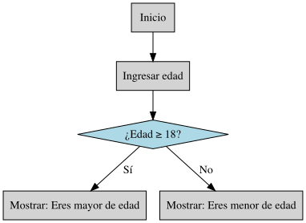
```

]

---

## Para escribir un buen software necesitas:

> Escribir código mantenible (maintainable code), usar control de versiones (version control) y rastreadores de problemas (issue trackers), revisiones de código (code reviews), pruebas unitarias (unit testing) y automatización de tareas (task automation).
>
> [Wilson, *et al.* 2014. *PLOS Biology*](https://journals.plos.org/plosbiology/article?id=10.1371/journal.pbio.1001745)

```{r, echo=FALSE, out.width='60%', fig.align='center'}
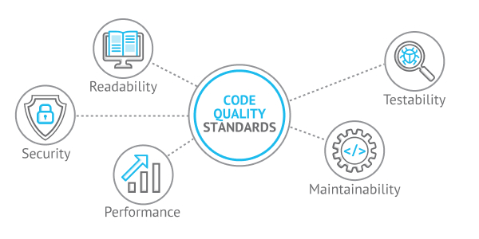
```
.left[.footnote[.black[
Imagen tomada de: https://devcom.com/tech-blog/code-quality-definition-how-to-improve-code-quality/
]]]

---

## Pasos para escribir un buen software

.pull-left[
1. Análisis del problema / Definir el problema

2. Diseño del algoritmo / Diseño del programa

3. Codificación / Escribir el código

4. Compilación y ejecución del programa

5. Verificación / Realizar pruebas

6. Depuración / Detectar los errores y corregirlos
> Programacion defensiva

7. Documentación
]

.pull-right[

```{r, echo=FALSE, out.width='80%', fig.align='center'}
knitr::include_graphics("figures/homersapien.jpg")
```
]

---

## Paso 7: Documentación

```{r, echo=FALSE, out.width='80%', fig.align='center'}
knitr::include_graphics("figures/reproducibility_court.png")
```

.left[.footnote[.black[
Imagen tomada de: [Allison Horst](https://allisonhorst.com/allison-horst) 
]]]

---

## Correcta documentación de nuestro código

.content-box-blue[

- **Título:** (opcional)

- **Autor (author):** Su nombre

- **Dia (date):** Fecha de creación

- **Paquetes** (packages)

- **Directorio de trabajo (Working directory):** En que carpeta se encuentra tu datos y programa.

- **Información descriptiva del programa (Description):** ¿Para qué sirve el programa? Ej: El siguiente programa realiza la suma de dos números enteros a partir de la entrada del usuario y posteriormente la imprime en pantalla.

- **Usage ¿Cómo se utiliza?**

- **Argumentos (Arguments)**

  + Información de entrada (Data Inputs): Ej: Solo números enteros (sin decimales).

  + Información de salida (Outpus): Gráficas, figuras, tablas, etc.

]

---

```{r, echo=FALSE, out.width='40%', fig.align='center'}
knitr::include_graphics("figures/meme_documentacion.jpg")
```

---

## Ejercicio en grupo: Lluvia de ideas 🧬

.content-box-blue[
Tras meses de trabajo y espera, finalmente obtienes los resultados de tu análisis de secuenciación. Emocionadx, decides compartirlos con unx colega que intenta replicar el proceso. Sin embargo, al comparar los resultados, ambos se sorprenden: los resultados que obtuvieron no coinciden.

**¿Qué pudo haber salido mal? ¿Por qué los resultados no fueron reproducibles?**
]

---

## Preguntas clave para garantizar una documentación robusta y reproducible

1. **Origen y versión de los datos:** 📊 ¿Todos los datos provienen de la misma fuente y corresponden a la misma versión o fecha de descarga?

2. **Versionado de herramientas:** 🚀 ¿Se utilizó la misma versión de cada programa, paquete o entorno en todos los análisis?

3. **Parámetros de ejecución:** 📐 ¿Los programas se ejecutaron con los mismos parámetros, opciones y configuraciones?

4. **Registro y trazabilidad:** 📈 ¿Se documentaron explícitamente estas decisiones en un archivo accesible y versionado?

---

## Puntos claves para buenas prácticas en bioinfo ⭐

1. Escriba **programas para personas, no para computadoras** (Documenta qué hace y por qué). - Se coherente en la nomenclatura, indentación y otros aspectos del estilo.

2. Divide los programas en funciones cortas de un solo propósito. 💻 📚

3. **No repitas tu código.** Crea pasos reproducibles o que se repitan por si solas. ➰

4. Planifique los errores (**Programacion defensiva**) 🚩

5. Optimice el software sólo después de que funcione correctamente. - Si funciona no lo modifiques, simplificalo.

6. Colaborar - Busque siempre bibliotecas de software bien mantenidas que hagan lo que necesita. 👥


> Ejemplo de como realizo mis documentos 💜
> Aqui les dejo el script que les doy a mis alumnos [VisualizacionDatos.R](https://github.com/EveliaCoss/RNAseq_classFEB2024/blob/main/Practica_Dia3/scripts/VisualizacionDatos.R) del curso de [Análisis de datos de RNA-Seq](https://github.com/EveliaCoss/RNAseq_classFEB2024).

---
class: inverse, center, middle

`r fontawesome::fa("laptop-file", height = "3em")`
# Ciencia abierta y Reproducibilidad 
---

##  Desafío

.center[.content-box-purple[
El **código y los datos** deben encontrarse disponibles.
]]

```{r, echo=FALSE, out.width='50%', fig.align='center'}
knitr::include_graphics("figures/operncode.jpg")
```

.left[.footnote[.black[
Imagen tomada de: [The Turing Way Community, & Scriberia (2020)](https://zenodo.org/records/4323154)
]]]

---

## Código

Se refiere a los **scripts, programas o fragmentos de instrucciones escritas en lenguajes de programación** (como Python, R, Bash, entre otros) que permiten *analizar, visualizar y procesar datos biológicos.* 

.pull-left[

Aplicaciones prácticas

- Filtrar y transformar datos genómicos.
- Crear figuras científicas reproducibles.
- Diseñar primers para PCR.
- Modelar estructuras proteicas.
- Documentar análisis para enseñanza o publicación.
]

.pull-right[
```{r, echo=FALSE, out.width='100%', fig.align='center'}
knitr::include_graphics("figures/map_frosting.png")
```
]

.left[.footnote[.black[
Imagen tomada de: [Allison Horst](https://allisonhorst.com/allison-horst) 
]]]

---

## Datos en investigación

.pull-left[
Como científico puedes:

- **Generar datos** mediante experimentos, muestreos o curación.
- **Analizar datos de terceros** para descubrir nuevo conocimiento, según su nivel de procesamiento:
  + **Primarios:** Recolectados pero sin procesar (ej. observaciones, notas de campo).
  + **Procesados:** Digitalizados, transcritos, limpiados y validados.
  + **Analizados:** Transformados en modelos, gráficos o textos que facilitan conclusiones y decisiones.
]

.pull-right[
```{r, echo=FALSE, out.width='100%', fig.align='center'}
knitr::include_graphics("figures/presenting_monster.png")
```
]

.left[.footnote[.black[
Diapositiva proveniente de [Heladia Salgado](https://lcg-cursos.github.io/material/introbioinfo/L2-buenas-practicas.html#22) e información proveniente de [Gestión de datos de investigación](https://biblioguias.cepal.org/gestion-de-datos-de-investigacion/tipos-datos)]]]

---

## `r fontawesome::fa("bookmark", height = "1em", fill="purple")` Reproducibilidad 

**Reproducibilidad computacional** es que otra persona pueda ejecutar el **código que hemos creado y tenga los mismos resultados.**

.pull-left[
Esto incluye a:

- Científicos de otras instituciones
- Colaboradores
- Nosotros mismos

```{r, echo=FALSE, out.width='50%', fig.align='center'}
knitr::include_graphics("figures/Reproduciblereasearrch.png")
```

.left[.footnote[.black[
Diapositiva proveniente de [Miriam Lerma](https://miriamll.github.io/teaching_R_Rmd/Repro#5) e Imagen tomada de: [Kirstie Jane](https://github.com/WhitakerLab/ReproducibleResearch) 
]]]

]

--

.pull-right[
```{r, echo=FALSE, out.width='80%', fig.align='center'}
knitr::include_graphics("figures/meme3.jpeg")
```

]

---

## Dimensiones de la reproducibilidad

La reproducibilidad tiene varias dimensiones, de acuerdo a:

- si usamos los **mismos datos o datos diferentes**
- si usamos el **mismo código o lo adaptamos**

.pull-left[
```{r, echo=FALSE, out.width='120%', fig.align='center'}
knitr::include_graphics("figures/ReproducibleMatrix.jpg")
```
]

.pull-right[
- **Reproducible:** mismos datos deben dar el mismo resultado.
- **Replicable:** mismos análisis pero con diferentes datos dan resultados cualitativamente similares.
- **Robusto:** los mismos datos pero diferente análisis, dan resultados similares.
- **Generalizable:** diferentes datos y análisis para entender que los resultados no son dependientes de ese set de datos en particular y de ese análisis en particular.

]

.left[.footnote[.black[
Diapositiva proveniente de [Miriam Lerma](https://miriamll.github.io/teaching_R_Rmd/Repro#6) e imagen tomada de [Showing your working](https://figshare.com/articles/journal_contribution/Showing_your_working_a_how_to_guide_to_reproducible_research/5443201/1?file=9410686) de [Kirstie Jane](https://github.com/WhitakerLab/ReproducibleResearch) ]]]

---

## Principios FAIR

> **Objetivo:** Implementar las **buenas prácticas** para la gestión y administración de datos científicos. 

.pull-left[

Recordemos que:
El método científico esta sustentado en dos pilares: **reproducibilidad y refutabilidad**.

```{r, echo=FALSE, out.width='60%', fig.align='center'}
knitr::include_graphics("figures/FAIRPrinciples.jpg")
```

Lema: **"Tan abiertos como sea posible, tan cerrados como sea necesario" (abierto por defecto)**

]

.pull-right[
- Se requiere claridad y transparencia en torno a las condiciones que rigen el acceso y la reutilización.
- 4 principios principales:
  + **Findable (Encontrables):** fácilmente localizables mediante identificadores únicos y metadatos claros.
  + **Accessible (Accesibles):** disponibles para su consulta, incluso si requieren autenticación.
  + **Interoperable (Interoperables):** compatibles con otros sistemas y lenguajes estándar.
  + **Reusable (Reutilizables):** descritos con suficiente detalle para ser reutilizados en distintos contextos.
]

.left[.footnote[.black[
Información proveniente de [datos.gob.es](https://datos.gob.es/es/noticia/principios-fair-buenas-practicas-para-la-gestion-y-administracion-de-datos-cientificos) [Florecia D´Andrea](https://flor14.github.io/rladies-jujuy/presentacion.html?panelset=compendio&panelset1=bibliograf%25C3%25ADa#7) y [Miriam Lerma](https://miriamll.github.io/teaching_R_Rmd/Repro#7). Imagen proveniente de [The Turing Way Community, & Scriberia. (2020).](https://zenodo.org/records/3695300)]]]

---

## Credibilidad

.pull-left[
Al hacer nuestro trabajo reproducible.
Podemos:

- Evitar desastres al permitir detección de errores
- Escribir mas fluido
- Asegurar la continuidad
- Mejorar la credibilidad/transparencia
- Evitar retracciones de articulos
- Anota todo lo que hiciste:
  + ¿De dónde descargaste los datos?
  + ¿Cuáles son las suposiciones acerca de los datos iniciales?
  + ¿Qué hacia esa función compleja y rebuscada que pensaste era una joya en su momento?

]

.pull-right[
```{r, echo=FALSE, out.width='120%', fig.align='center'}
knitr::include_graphics("figures/reproducibility_court.png")
```
]

.content-box-gray[
Por ejemplo, evitando casos como: [revistas retiran articulos sobre COVID debido a falta de integridad en los datos](https://www.science.org/content/article/two-elite-medical-journals-retract-coronavirus-papers-over-data-integrity-questions).
]

.left[.footnote[.black[
Información proveniente de [Miriam Lerma](https://miriamll.github.io/teaching_R_Rmd/Repro#8) y [Heladia Salgado](https://lcg-cursos.github.io/material/introbioinfo/L2-buenas-practicas.html#44). Imagen tomada de: [Allison Horst](https://allisonhorst.com/allison-horst) ]]]

---

## Código reproducible 🌟

.pull-left[
### Contenedores ⚡

.pull-left[
- [Docker](https://docs.docker.com/) 
- [Singularity](https://docs.sylabs.io/guides/3.5/user-guide/introduction.html)
- [Apptainer](https://apptainer.org/)
]

.pull-right[
```{r, echo=FALSE, out.width='50%', fig.align='right'}

```
]

Se puede almacenar todo el workflow, archivos, generando código reproducible y cooperativo.

> Manual de uso de [Singularity](https://docs.sylabs.io/guides/3.5/user-guide/).

]

.pull-right[

.pull-left[
### Crear pipelines completos 🌀

- [Nextflow](https://training.nextflow.io/es/) 
- [Snakemake](https://snakemake.readthedocs.io/en/stable/tutorial/tutorial.html)
]

.pull-right[
```{r, echo=FALSE, out.width='80%', fig.align='right'}
knitr::include_graphics("figures/nf-core-logo.png")
```
] 

.content-box-gray[
Curso de Nextflow en los [VieRnes de Bioinformática (2024)](https://github.com/EveliaCoss/ViernesBioinfo2024#viernes-22-23-y-24-nextflow) con el Dr. Israel Aguilar.
]

]

---

## Vulnerabilidad crítica en Docker `r fontawesome::fa("docker", height = "1em", fill="blue")`

.pull-left[
```{r, echo=FALSE, out.width='80%', fig.align='right'}
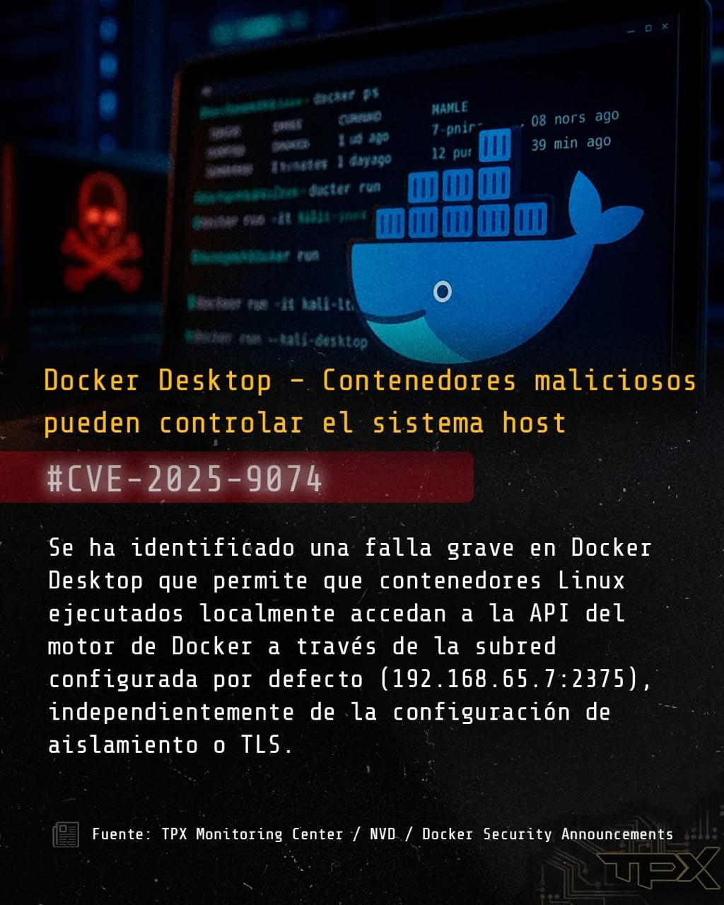
```
]


.pull-right[
- La vulnerabilidad permite acceso privilegiado a través de la API del Docker Engine sin requerir autentificación. Afecta incluso con aislamiento mejorado (ECI).
- Se supone que se "solucionó" el problema en la versión 4.44.3, por lo que, se recomienda la actualización inmediata.
]

.content-box-gray[
En el cluster DNA y Fenix de LAVIS se encuentra bloqueado Docker. No encontrarás un módulo con su nombre.
]


---

## Repositorios digitales abiertos

Contar con repositorios digitales de acceso **abierto** diseñado para **almacenar, compartir y preservar productos** de investigación científica.

.panelset[
.panel[.panel-name[Repositorios académicos y científicos]

| Página web    | Descripción breve                                                             |
|---------------|-------------------------------------------------------------------------------|
| [Figshare](https://figshare.com/) | Ideal para compartir datasets, figuras, presentaciones y multimedia con DOI.       |
| [bioRxiv](https://www.biorxiv.org/) / [medRxiv](https://www.medrxiv.org/)  | Preprints en biología y medicina, respectivamente.                       |

]

.panel[.panel-name[Repositorios de software y código]

| Repositorio   |  Enfoque principal                                                            |
|---------------|-------------------------------------------------------------------------------|
| [GitHub](https://github.com/)        | Desarrollo colaborativo de software, documentación y automatización.          |
| [GitLab](https://about.gitlab.com/gitlab-duo/agent-platform/)        | Similar a GitHub, con más control sobre privacidad y CI/CD integrado.         |
| [Bitbucket](https://bitbucket.org/product/)     | Integración con Jira y herramientas ágiles, útil para equipos técnicos.       |
| [Zenodo](https://zenodo.org/)      | Publicación de software, datasets y documentación con DOI; integración directa con GitHub para versionado y citación reproducible. Ideal para proyectos científicos y educativos.  |

]
]


---
class: inverse, center, middle

`r fontawesome::fa("laptop-file", height = "3em")`
# Zenodo

---

## Zenodo

**Zenodo** es un repositorio de acceso abierto operado por [CERN (Organización Europea para la Investigación Nuclear)](https://www.home.cern/). 

.pull-left[

Permite que se depositen allí **artículos de investigación, datos, software, informes y otro tipo de objeto digital** relacionado con la investigación.

> La ventaja frente a GitHub es que asigna un **Digital Object Identifier (DOI).**

```{r, echo=FALSE, out.width='60%', fig.align='right'}

```

]


.pull-right[
```{r, echo=FALSE, out.width='100%', fig.align='right'}
knitr::include_graphics("figures/DOI.jpg")
```
]


.left[.footnote[.black[
Imagen tomada de: [The Turing Way Community, & Scriberia (2020)](http://doi.org/10.5281/zenodo.3695300)
]]]

---

## 🔍 ¿Para qué sirve Zenodo?


- **Publicar artículos, datasets, software y más:** Puedes subir desde papers y conjuntos de datos hasta scripts, presentaciones y materiales didácticos.
- **Asignar DOI automáticamente:** Cada archivo recibe un identificador digital persistente (DOI), lo que facilita su citación y trazabilidad.
- **Cumplir con políticas de ciencia abierta:** Ideal para proyectos financiados por organismos que exigen acceso abierto.
- **Crear comunidades temáticas:** Puedes agrupar tus publicaciones en colecciones colaborativas.
- **Versionado y licencias:** Permite subir nuevas versiones de un mismo trabajo y elegir licencias como CC BY 4.0.

---

## Zenodo en publicaciones

Cada vez más revistas exigen que los autores incluyan **datos y/o código** como parte integral de sus publicaciones, promoviendo la transparencia y la reproducibilidad.

Por ejemplo:

- [**Frontiers**](https://helpcenter.frontiersin.org/s/article/What-do-I-need-to-disclose): Solicita que todos los datos relevantes para las conclusiones del manuscrito estén disponibles públicamente y citados adecuadamente, conforme a sus lineamientos editoriales.

```{r, echo=FALSE, out.width='70%', fig.align='center'}
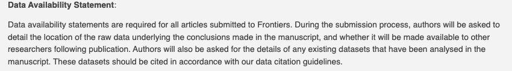
```

- [**PLOS ONE**](https://journals.plos.org/plosone/s/data-availability): Exige que los autores incluyan una sección específica que redirija al repositorio público donde los datos están accesibles, o bien que los datos estén incorporados directamente en el artículo.

```{r, echo=FALSE, out.width='70%', fig.align='center'}
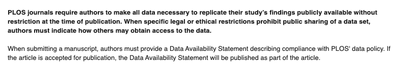
```

---

## Visualización de Zenodo (ejemplo)

```{r, echo=FALSE, out.width='70%', fig.align='center'}
knitr::include_graphics("figures/zenodo_versioning.png")
```


.left[.footnote[.black[
Imagen tomada de: [Zenodo now supports DOI versioning!](https://blog.zenodo.org/2017/05/30/doi-versioning-launched/)
]]]

---

## Ejemplo práctico: Paquete `palmerpenguins`

Si estás desarrollando un paquete en R, puedes subir el **código, documentación, ejemplos y datasets a Zenodo.** Al vincularlo con GitHub, incluso puedes generar un DOI para cada release del repositorio.

.pull-left[
```{r, echo=FALSE, out.width='60%', fig.align='center'}
knitr::include_graphics("figures/palmerpenguins.png")
```
]

.pull-right[
- Paquete en CRAN: [palmerpenguins](https://allisonhorst.github.io/palmerpenguins/articles/intro.html)
- GitHub: [palmerpenguins](https://github.com/allisonhorst/palmerpenguins/)
- Zenodo del paquete: [allisonhorst/palmerpenguins: v0.1.0](https://zenodo.org/records/3960218)
- Zenodo de los datos: [datos de palmerpenguins](https://zenodo.org/records/14902740)
- Datos provenientes de: Gorman KB, Williams TD, Fraser WR (2014). Ecological sexual dimorphism and environmental variability within a community of Antarctic penguins (genus Pygoscelis). PLoS ONE 9(3):e90081.https://doi.org/10.1371/journal.pone.0090081

```{r, echo=FALSE, out.width='60%', fig.align='center'}
knitr::include_graphics("figures/culmen_depth.png")
```
]

---

## Citar Zenodo

Debes incluir un ejemplo de cómo citar tu material en el README o documentación. 

```{r}
citation("palmerpenguins")
```

---

class: inverse, center, middle

`r fontawesome::fa("github", height = "3em")`
# Git y GitHub

---

## 📚 Actividad: Miniresumen personal + foto para tu repositorio

.pull-left[
- Escribe un **miniresumen** en texto plano sobre ti. Debe tener entre 5 y 10 líneas.
- Puedes usar [emojis](https://gist.github.com/rxaviers/7360908) para representar tus gustos, intereses o personalidad
- El texto debe incluir:
  + Tus intereses académicos o personales
  + Qué te gusta hacer en tu tiempo libre
  + Qué te motiva a aprender ciencia o programación
  + Algún dato curioso o divertido sobre ti
]
  
.pull-right[
```{r, echo=FALSE, out.width='100%', fig.align='right'}
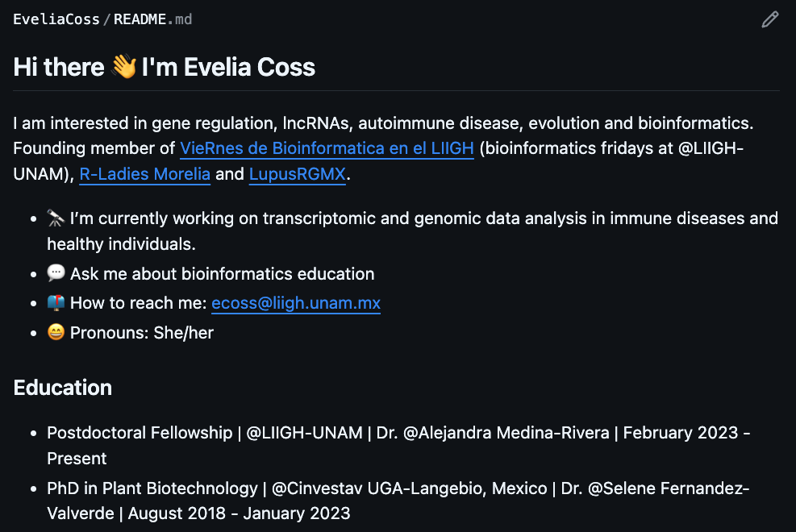
```
Mi ejemplo: [EveliaCoss](https://github.com/EveliaCoss/EveliaCoss)
]

---

## Paso a paso

### 1. Crear un Repositorio con el mismo nombre de usuario

En mi Ejemplo: Si mi usuario es **EveliaCoss** el repositorio debe llamarme **EveliaCoss**.

```{r, echo=FALSE, out.width='80%', fig.align='center'}
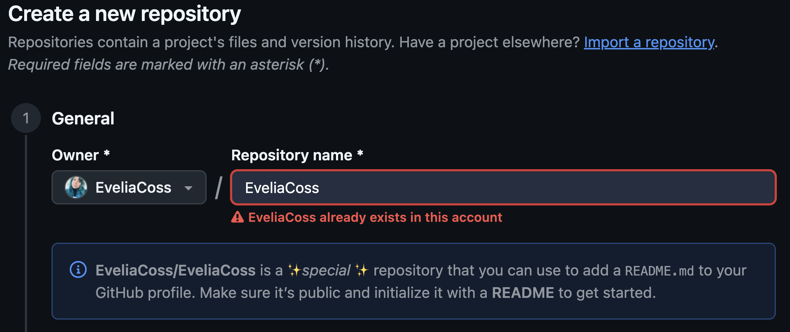
```

---

### 2. Seleccionar la configuración y dar click en crear repositorio

```{r, echo=FALSE, out.width='80%', fig.align='center'}
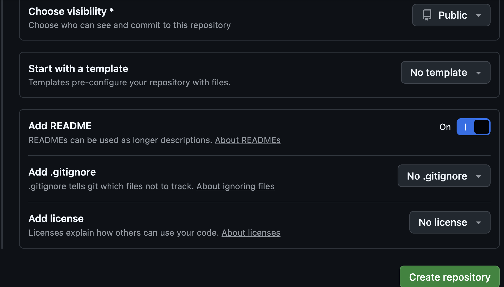
```

---

### 3. Da click en el lapiz (✏️) para editar el *README.md*

```{r, echo=FALSE, out.width='60%', fig.align='center'}
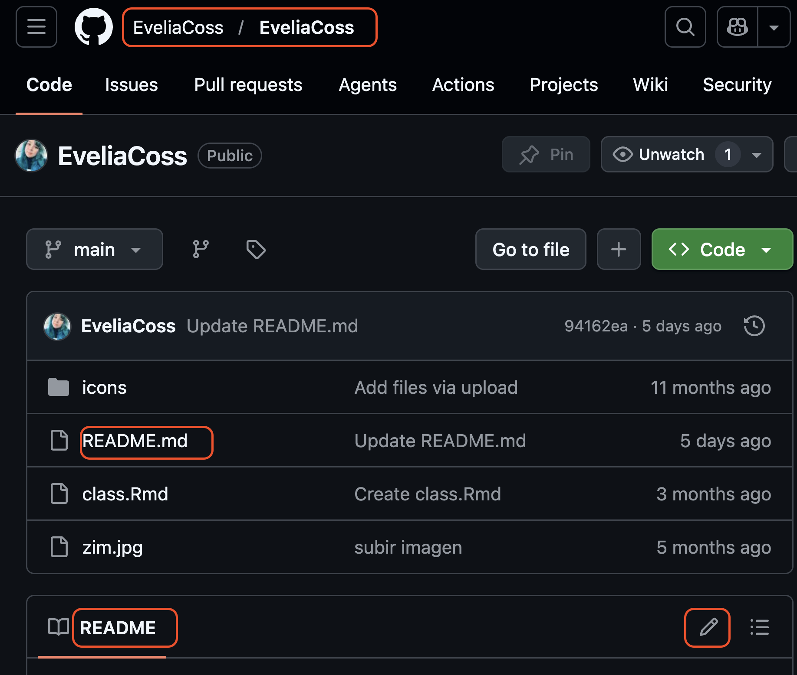
```

---

### 4. Eliminar los comentarios `<!--` y `-->`

```
### Hi there 👋

<!-- 
* 👂 My name is ...
* 👩 Pronouns: ...
* 🔭 I’m currently working on ...
* 🌱 I’m currently learning ...
* 🤝 I’m looking to collaborate on ...
* 🤔 I’m looking for help with ...
* 💬 Ask me about ...
* 📫 How to reach me: ...
* ❤️ I love ...
* ⚡ Fun fact: ...

-->
```

### 5. Modifica tu información y guarda los cambios en un commit

---

## GitHub Profile README Generator

Pueden generar su propio README para su perfil usando [GitHub Profile README Generator](https://rahuldkjain.github.io/gh-profile-readme-generator/): 

```{r, echo=FALSE, out.width='60%', fig.align='center'}
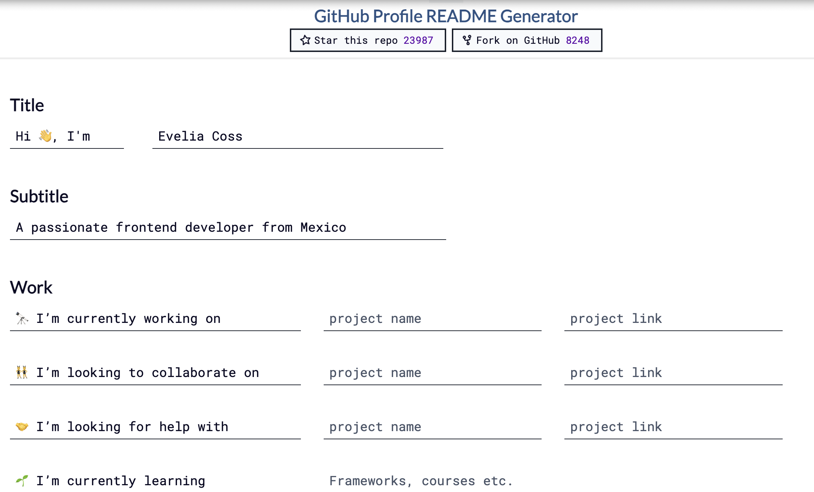
```

---
class: center, middle

`r fontawesome::fa("code", height = "3em")`
# Próxima clase: 19 de febrero, 2026
## Introducción a Quarto

Gracias por tu atención, respira y coméntame tus dudas. 

```{r, echo=FALSE, out.width='20%', fig.align='right'}
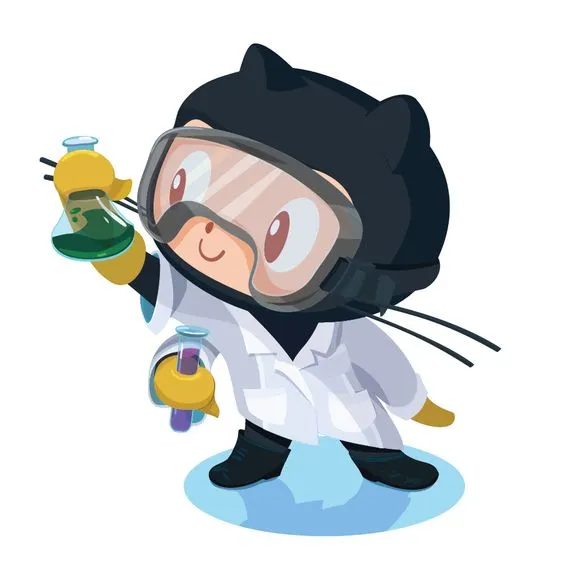
```
