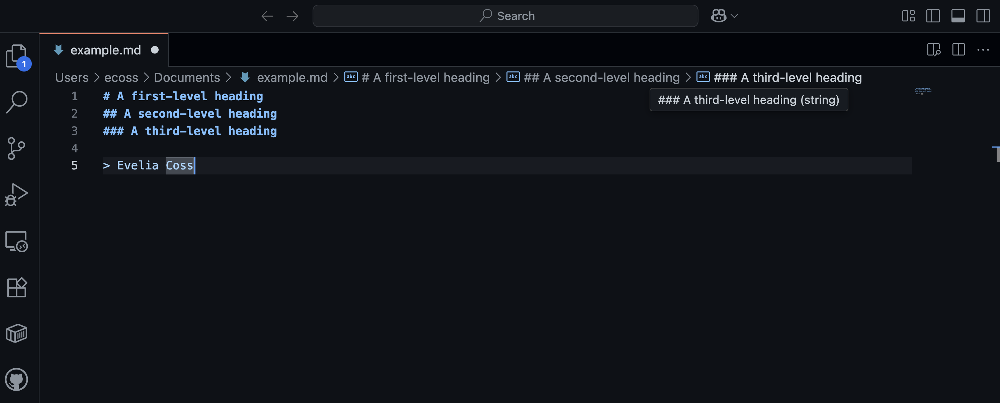
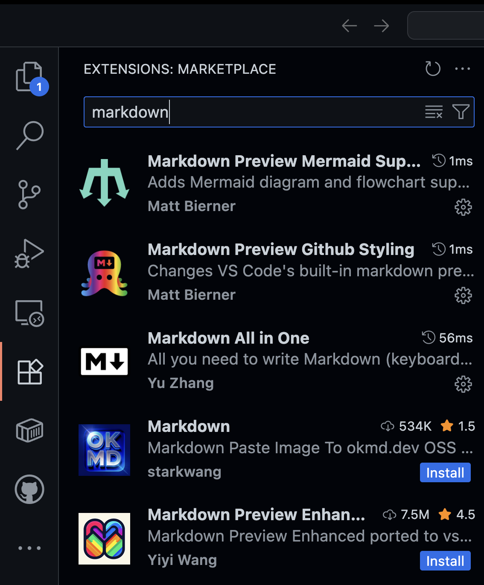
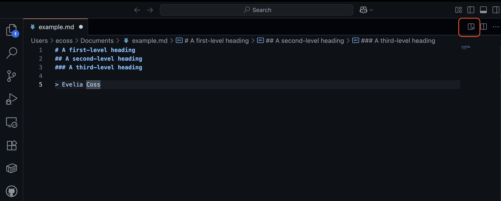
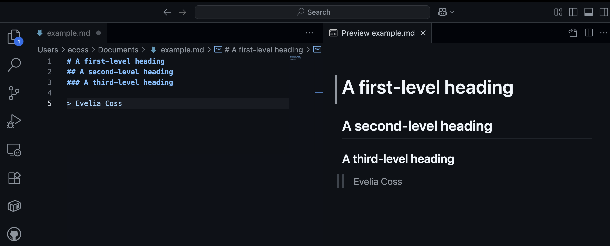

```{r setup, include = FALSE}
# Setup chunk
# Paquetes a usar
#options(htmltools.dir.version = FALSE) cambia la forma de incluir código, los colores

library(knitr)
library(tidyverse)
library(xaringanExtra)
library(icons)
library(fontawesome)
library(emo)
library(countdown) # remotes::install_github("gadenbuie/countdown", subdir = "r"), Explicacion de su uso: https://pkg.garrickadenbuie.com/countdown/#5

# set default options
opts_chunk$set(collapse = TRUE,
               dpi = 300,
               warning = FALSE,
               error = FALSE,
               comment = "#")

top_icon = function(x) {
  icons::icon_style(
    icons::fontawesome(x),
    position = "fixed", top = 10, right = 10
  )
}

knit_engines$set("yaml", "markdown")

# Con la tecla "O" permite ver todas las diapositivas
xaringanExtra::use_tile_view()
# Agrega el boton de copiar los códigos de los chunks
xaringanExtra::use_clipboard()

# Crea paneles impresionantes 
xaringanExtra::use_panelset()

# Para compartir e incrustar en otro sitio web
xaringanExtra::use_share_again()
xaringanExtra::style_share_again(
  share_buttons = c("twitter", "linkedin")
)

# Funcionalidades de los chunks, pone un triangulito junto a la línea que se señala
xaringanExtra::use_extra_styles(
  hover_code_line = TRUE,         #<<
  mute_unhighlighted_code = TRUE  #<<
)

# Agregar web cam
xaringanExtra::use_webcam()

# barra de progreso
xaringanExtra::use_progress_bar(color = "#0051BA", location = "top", height = "10px")
```

```{r xaringan-editable, echo=FALSE}
# Para tener opciones para hacer editable algun chunk
xaringanExtra::use_editable(expires = 1)
# Para hacer que aparezca el lápiz y goma
xaringanExtra::use_scribble()
```

```{r xaringan-themer Eve, include=FALSE, warning=FALSE}
# Establecer colores para el tema
library(xaringanthemer)

palette <- c(
 orange        = "#fb5607",
 pink          = "#ff006e",
 blue_violet   = "#8338ec",
 zomp          = "#38A88E",
 shadow        = "#87826E",
 blue          = "#1381B0",
 yellow_orange = "#FF961C"
  )

#style_xaringan(
style_duo_accent(
  background_color = "#FFFFFF", # color del fondo
  link_color = "#562457", # color de los links
  text_bold_color = "#0072CE",
  primary_color = "#01002B", # Color 1
  secondary_color = "#CB6CE6", # Color 2
  inverse_background_color = "#00B7FF", # Color de fondo secundario 
  colors = palette,
  
  # Tipos de letra
  header_font_google = google_font("Barlow Condensed", "600"), #titulo
  text_font_google   = google_font("Work Sans", "300", "300i"), #texto
  code_font_google   = google_font("IBM Plex Mono") #codigo
  #text_font_size = "1.5rem" # Tamano de letra
)

# https://www.rdocumentation.org/packages/xaringanthemer/versions/0.3.4/topics/style_duo_accent
```

class: title-slide, middle, center
background-image: url(figures/Clases_Rladies_Slide1_reproducible.png) 
background-position: 90% 75%, 75% 75%, center
background-size: 1210px,210px, cover


.center-column[
# `r rmarkdown::metadata$title`
### `r rmarkdown::metadata$subtitle`

####`r rmarkdown::metadata$author` 
#### `r rmarkdown::metadata$date`
]

.left[.footnote[R-Ladies Theme[R-Ladies Theme](https://www.apreshill.com/project/rladies-xaringan/)]]

---
background-image: url(figures/liigh_unam_logo.png) 
background-position: 10% 10%
background-size: 10%
class: middle, center


# Sobre mi
----

.left-col[

### `r fontawesome::fa("dna", fill = "#181818")` Dra. Evelia Lorena Coss-Navarrete

Investigadora Posdoctoral en el Laboratorio Internacional de Investigación sobre el Genoma Humano [(LIIGH), UNAM](https://twitter.com/LIIGH_UNAM), campus Juriquilla


[`r fontawesome::fa("link")` Dra Alejandra Medina-Rivera](https://liigh.unam.mx/profile/dra-alejandra-medina-rivera/)

[`r fontawesome::fa("github")` EveliaCoss.github.io](https://eveliacoss.github.io/)

]


.center-col[


### `r fontawesome::fa("star", fill = "#181818")` Miembro

- [LupusRGMX](https://twitter.com/LupusRgmx)
- [Proyecto JAGUAR](https://twitter.com/PJaguarLATAM)
- [Rladies Morelia](https://www.facebook.com/profile.php?id=100093337606435)
- [CDSB - Mexico](https://twitter.com/CDSBMexico)
- [RIABIO](https://twitter.com/RiaBioNet)
- [The Carpentries](https://carpentries.org/index.html)
- [ISCB-RSG Mexico](https://rsg-mexico.iscbsc.org/)
- [ISCB Wikipedia team](https://x.com/iscbwikiteam)
]


.right-col[

### `r fontawesome::fa("circle-nodes", fill = "#181818")` Formación académica

- Doctorado en Biotecnología de Plantas, [Cinvestav, Langebio](https://twitter.com/uga_langebio),  [`r fontawesome::fa("link")` Dra Selene Fernandez-Valverde](https://twitter.com/SelFdz)
- Maestría en Biotecnología de Plantas, [Cinvestav, Unidad Irapuato](https://twitter.com/CinvestavIra)
- Ing. en Biotecnología, [UPSIN](https://www.facebook.com/UPSINSINALOA)

]


---
class: inverse, center, middle

`r fontawesome::fa("laptop-file", height = "3em")`
# ¿Qué es Markdown?
---

## ¿Qué es Markdown?

Markdown es un **lenguaje de marcado ligero** que permite añadir elementos de formato a documentos de *texto plano*. Creado por John Gruber en 2004, Markdown es actualmente uno de los lenguajes más populares del mundo.

- Sencillo y legible, sin necesidad de usar editores complicados o HTML.
- **lenguaje de marcado ligero:** Escribir texto que incluye instrucciones simples para darle formato.

--

### 🧩 ¿Por qué se llama “ligero”?

Porque:

- Usa símbolos sencillos como `*, #,` o `-` para indicar formato.
- No requiere cerrar etiquetas como `<strong> o <div>` (como en HTML).
- Es minimalista y limpio, ideal para escribir rápido sin distracciones.

---

## 🧠 ¿Para qué se usa?

- Crear documentación técnica o científica
- Escribir **README.md** en proyectos de GitHub
- Generar contenido para sitios web
- Crear [tesis](https://quarto.org/docs/get-started/hello/rstudio.html), notas, [libros](https://bookdown.org/yihui/rmarkdown-cookbook/), [presentaciones](https://bookdown.org/yihui/rmarkdown/xaringan.html) y posters

.panelset[
.panel[.panel-name[En R]

| Paquete / Programa     | Uso principal                                                                 |
|------------------------|-------------------------------------------------------------------------------|
| `rmarkdown`            | Crear documentos reproducibles con texto, código y resultados                |
| `knitr`                | Ejecutar chunks de código en RMarkdown                                       |
| `Quarto`               | Plataforma moderna para documentos con R, Python, etc.                       |
| `bookdown`             | Crear libros técnicos con Markdown + RMarkdown                               |
| `blogdown`             | Generar blogs científicos usando Markdown y Hugo                             |
| `flexdashboard`        | Dashboards interactivos escritos en Markdown                                 |


]

.panel[.panel-name[En Python]

| Paquete / Programa     | Uso principal                                                                 |
|------------------------|-------------------------------------------------------------------------------|
| Jupyter Notebooks      | Celdas Markdown para explicar y documentar junto con código                  |
| `Quarto`               | Igual que en R, permite combinar Markdown con código Python                  |
| `mkdocs`               | Generar sitios web de documentación técnica desde archivos Markdown          |
| `Sphinx + MyST`        | Documentación avanzada con soporte para Markdown                             |
| `markdown`, `mistune`  | Librerías para convertir Markdown a HTML                                     |
| `nbconvert`            | Exportar notebooks con Markdown a PDF, HTML, LaTeX, etc.                     |

]
]


---

## ¿Cómo funciona?

Pasos generales: 

1. Crear un archivo Markdown con un editor de texto o una aplicación específica. El archivo debe tener la extensión `.md o .markdown`.
2. Se abre el archivo Markdown en una aplicación Markdown.
3. Se utiliza la aplicación Markdown para convertir el archivo Markdown en un documento HTML.
4. Visualización del archivo HTML en un navegador web o use la aplicación Markdown para convertirlo a otro formato de archivo, como PDF.


.content-box-gray[
La aplicación y el procesador de Markdown son dos componentes independientes. Para simplificar, los he combinado en un solo elemento ("aplicación de Markdown") en la figura a continuación.
]

```{r, echo=FALSE, out.width='60%', fig.align='center'}
knitr::include_graphics("figures/markdown-flowchart.png")
```

.left[.footnote[.black[
Imagen tomada de: https://www.markdownguide.org/getting-started/
]]]

---

## Markdown app: Visual Studio Code

**Visual Studio Code** es un editor de código que combina las funcionalidades de un entorno de desarrollo integrado (IDE) con la simplicidad de un editor de texto. 


.pull-left[

#### ¿Por qué se usa?

- **VS Code** es gratuito y de código abierto
- Multiplataforma (Windows, macOS y Linux)
- Control de versiones integrado
- Amplia gama de extensiones

```{r, echo=FALSE, out.width='80%', fig.align='center'}
knitr::include_graphics("figures/vsc_logo.jpg")
```

]


.pull-right[

#### La interfaz de usuario

Al iniciar **VS Code** por primera vez encontraremos interfaz limpia y minimalista. Aunque pueda parecer simple a primera vista, la interfaz de VS Code es extremadamente poderosa y personalizable.

```{r, echo=FALSE, out.width='100%', fig.align='center'}

```

]


---


Vamos a instalarlo de acuerdo a [nuestra plataforma](https://code.visualstudio.com/).

---

## Vamos a instalar unas extensiones

Las extensiones de **VS Code** son complementos que puedes instalar para ampliar las funciones del editor según tus necesidades. Son como piezas de LEGO 🧱 que personalizan tu entorno de desarrollo, desde el lenguaje que usas hasta el estilo visual y herramientas de productividad.

```{r, echo=FALSE, out.width='100%', fig.align='center'}

```

---

## Lenguaje de programación Markdown

Vamos a ver como se realiza la Sintaxis de escritura y formatos básicos empleados en Markdown:

- [Documentación de GitHub](https://docs.github.com/es/get-started/writing-on-github/getting-started-with-writing-and-formatting-on-github/basic-writing-and-formatting-syntax) 
- [Rmarkdown](https://github.com/EveliaCoss/RmarkdownGraphs_notes)


---

```{r, echo=FALSE, out.width='100%', fig.align='center'}

```

---

```{r, echo=FALSE, out.width='100%', fig.align='center'}

```

---


---

class: center, middle

`r fontawesome::fa("code", height = "3em")`
# Fin

Gracias por tu atención, respira y coméntame tus dudas. 

